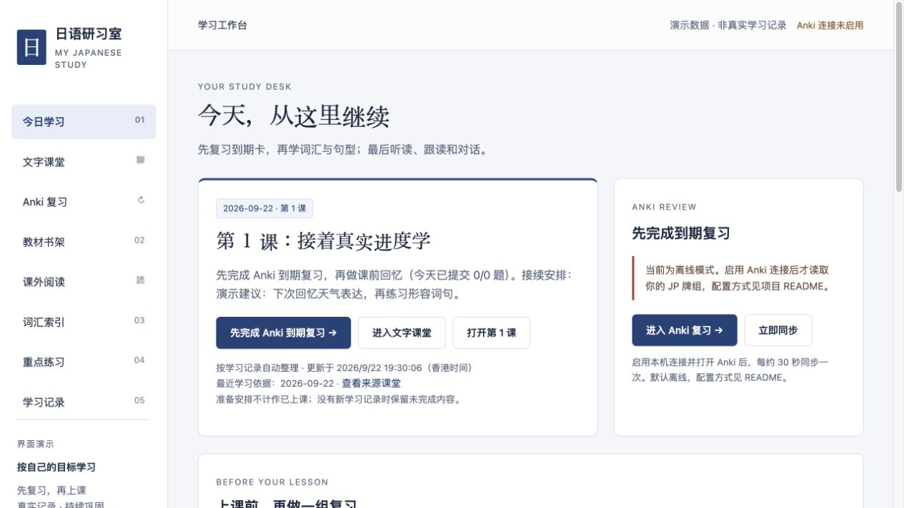
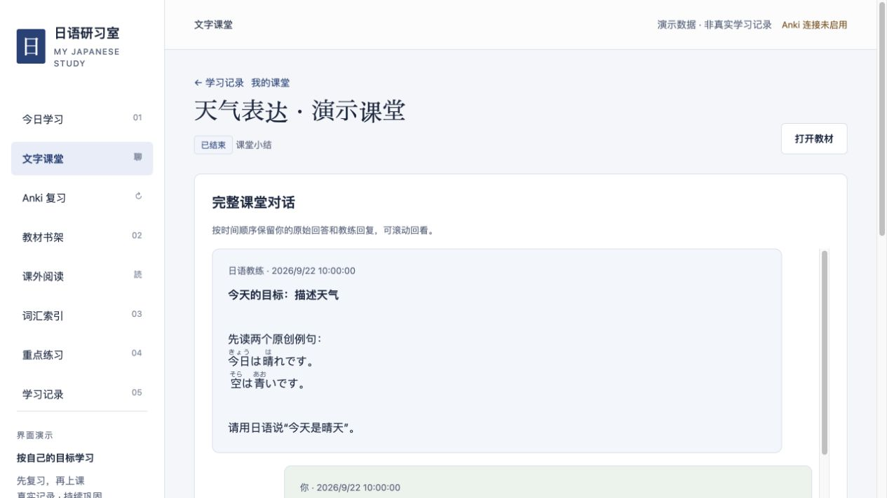
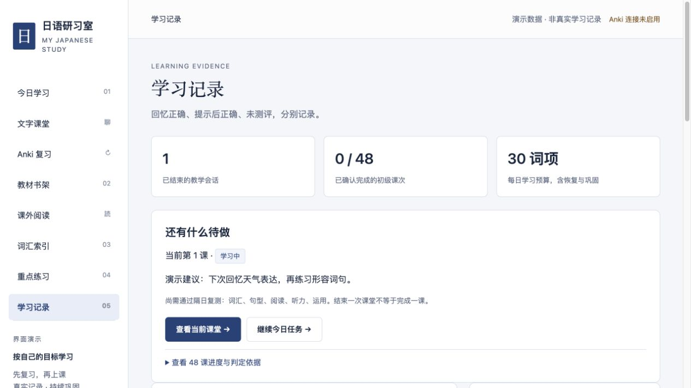

# 日语研习室

**源码可查看 · 禁止商用 · PolyForm Noncommercial 1.0.0**

[下载 v0.1.0](https://github.com/loftea/jp-study-site/releases/tag/v0.1.0) · [网站技能](skills/jp-study-site/SKILL.md) · [许可证](LICENSE)

本机运行的日语学习网站：教材与阅读、Anki 原生复习、Codex 文字课堂、带来源的长期记忆、课堂补充题和本地备份。前端使用原生 JavaScript，服务使用 Python 标准库。

仓库只包含程序、教学协议、配套 skill 和原创演示材料，不包含用户学习记录、教材/读物、音频、真实 Anki 笔记或任何登录凭据。默认关闭 Anki 和 Codex 连接。

## 界面预览

以下为隔离环境中的原创演示，**不是任何人的真实学习记录**；Anki 与 Codex 连接均关闭。

**今日学习：接续安排、复习入口与每日流程。**



**文字课堂：日语注音、原始回答与完整对话回看。**



**学习记录：完成情况与待复测事项分开展示。**



## 技能与下载

发布提供完整源码包 `jp-study-site-v0.1.0.zip` 和独立技能包 `jp-study-skills-v0.1.0.zip`，附 SHA-256 校验值。独立技能包包括：

- `jp-study-site`：指导从零建立站点、安装依赖、导入材料、维护架构与同步发布。
- `jp-listening-tts`：课堂结束时生成有真实依据的听力补充题；网站显式加载它。

技能包使用下方同版本源码，不包含教材或个人记录。可让 Codex 从此仓库的 `skills/jp-study-site` 安装技能，或在当前源码项目中明确让 Codex 读取该 `SKILL.md` 开始配置。安装技能本身不会自动开启 Anki/Codex、创建定时任务或导入书籍。

## 快速开始

需要 Python 3.10+；当前支持和验证重点是 macOS。TTS 依赖 macOS `say`（Kyoko）和 `afconvert`，后台守护/文件锁依赖 POSIX。Node.js 仅用于开发检查。

```sh
python3 scripts/build_learning_library.py
python3 website/serve.py
```

打开 http://127.0.0.1:8766/ 。首次构建生成两课原创示例；它们不是《标日》原文，也不是任何人的学习记录。

构建生成的 `study/` 和 `website/dist/data/` 已忽略，不提交 Git。学习记录留在当前项目下的 `study/`，保持本机访问。不要将服务绑定公网或通过反向代理暴露。

## 启用可选连接

这些变量由 shell 提供；`.env.example` 仅是说明，不会自动加载。不要向仓库提交自己的环境文件或 CLI 登录目录。

```sh
export JP_ANKI_ENABLED=1
export JP_CODEX_ENABLED=1
# 若 codex 不在 PATH，可显式设置 JP_CODEX_BIN 为本机可执行文件路径。
python3 website/serve.py
```

- **Codex**：使用自己安装并登录的 CLI；运行前查看 `codex exec --help`，版本需支持代码使用的结构化输出和沙箱参数。完整参数见 `website/classroom.py`，当前未承诺任意 CLI 版本均可用。此导出版本未运行真实付费推理验证。教学通过 schema 返回，后台校验、存储；不向教师开放任意写文件工具。无需把 API token 填入网页。
- **Anki**：打开自己的 Anki，安装 AnkiConnect。网站默认仅访问 loopback 的 8765 端口，可用 `JP_ANKI_URL` 指定其他本机端口。当前范围固定为 `JP` 及其子牌组，词汇字段沿用日文/释义/课号/词性/音频；并非通用模板适配器。自己的牌组不符合时需适配。原生评分组件的安装见 [Anki 说明](docs/anki.md)。
- **时间与词汇预算**：当前按香港自然日分组，默认每日30词项包括恢复/巩固；这些是程序默认值，不代表你的目标或掌握量。个人目标写入本机 `study/profile.json`。时区/牌组的全面可配置化尚未完成。

## 导入自己的学习材料

```sh
# 将已结构化的材料包转换为网站数据；结构参考 examples/library.demo.json
python3 scripts/build_learning_library.py --source /path/to/your-library.json
# 课外阅读，EPUB 可直接导入；PDF 另需 Poppler 的 pdfinfo/pdftoppm
python3 scripts/build_reading_library.py --source /path/to/book.epub --id my-book --title 我的读物
```

材料包包含 lessons、vocabulary、grammar、exercises、sources 数组。参考演示文件建立课次关系；标识采用 b01–b48。提供的字段会进入本机页面和教师上下文，勿导入不可信的代码或含凭据的导出。材料导入不会导入历史成绩或覆盖已有 profile/state，但会替换教材数据；替换前自行备份。

保留两种特定版式适配器：`build_textbook_exercises.py --source /path/to/textbook.pdf` 按指定版式页码关联初级上练习；`build_vocabulary_workbook.py --source /path/to/workbook.epub` 面向48课刷词手册。它们不是通用PDF/EPUB教材识别器，输入版本不匹配时应核对/调整规则。未随仓库附带书籍、提取正文、图片或答案。完整标日教材需要自行提供和校对。

## 已保留的流程

- 当天独立词单绑定实际 Anki 卡片，同日固定选择，离线不伪造新快照。
- Anki → 课前练习 → 课堂 → 课后练习的任务状态来自真实记录。
- 课堂保留完整对话、总结、长期记忆与补充听力题；数据由后台持久化。
- 课次分为学习中、待复测、已完成；五领域练习和后续自然日独立复测提供依据。结束聊天不等于学完一课。
- 中日混合文字仅对显式 `｜漢字《かな》` 做注音；阅读器内部翻页；轮询只更新对应区域。
- 后台子服务退出后恢复、可查询服务状态、ZIP 备份带哈希校验。不能恢复尚未保存的推理，不自动重放课堂。

## 后台运行、备课与备份

```sh
python3 scripts/start_site_background.py
python3 scripts/prepare_daily_study.py --context
python3 scripts/backup_study.py
python3 scripts/backup_study.py --verify /path/to/backup.zip --restore-to /path/to/new-empty-directory
```

发布版**没有预装每日自动化或登录自启动**。用户自行配置调度，不能继承开发者私人自动化 ID。备课发布协议见配套技能。备份保存在 `backups/study/`，恢复仅允许空目录；本机备份不代替异地备份，不包含教材和 Anki 数据库。

## 验证与配套技能

在新的隔离副本运行 `python3 scripts/check_release.py`，执行代码检查、隔离回归、HTTP 启动检查和 Git 文件隐私检查。测试不连接真实 Anki、不调用 Codex、不向正式学习库提交答案。发布前还应复查 `git ls-files` 与提交历史。

[配套 skill](skills/jp-study-site/SKILL.md) 使用当前项目作为根目录，指导安装、维护与发布，不固定某人的电脑路径。[发布检查说明](docs/release-review.md) 记录扫描范围、验证结果和限制。

## 许可证：禁止商用

本仓库的原创源码、配套技能、文档、原创示例及演示截图使用 [PolyForm Noncommercial 1.0.0](LICENSE)，分发时须保留 [NOTICE](NOTICE) 与许可条款。此许可不授予商业用途；商用需另行获得版权所有者许可。具体允许的非商业用途及组织类别以许可证全文为准。

这是带非商业限制的源码公开项目，不宣称属于允许商业使用的开源许可证。第三方软件、教材与用户导入材料仍遵守各自条款，本仓库不授予其再分发权利。
